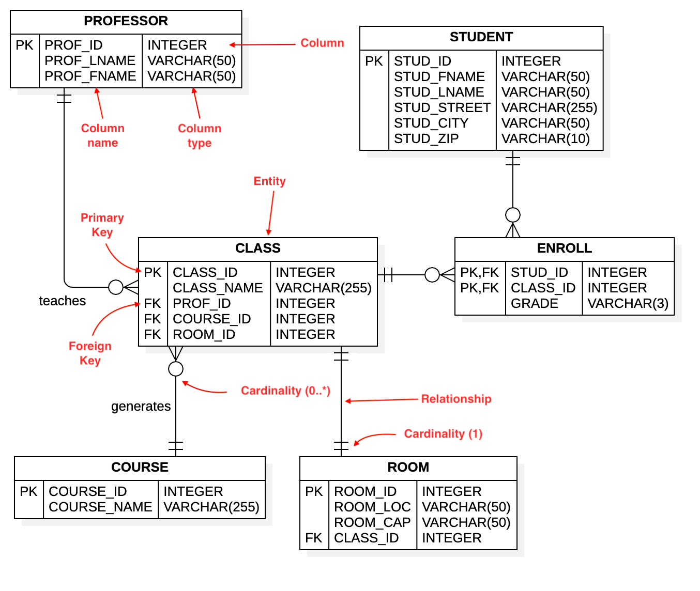

Assignment 1:

Database

Mỗi bài tập sẽ lưu trên file sol-{number}.sql

1. Giải bài tập trên leetcode: 

https://leetcode.com/problems/capital-gainloss/description/ (gợi ý: sử dụng CASE)

2. Bạn hãy viết một script để tạo các bản cho hệ thống với cấu trúc ở dưới

hệ thống bao gồm:

- class
- professor: quan hệ one-many với class
- student: quan hệ many-many với class
- course: quan hệ one-many với class
- room: quan hệ one-one với class

3. Hãy viết câu query để tìm:
- những cặp student-professor có dạy học nhau và số lớp mà họ có liên quan
- những course (distinct) mà 1 professor cụ thể đang dạy
- những course (distinct) mà 1 student cụ thể đang học
- điểm số là A, B, C, D, E, F tương đương với 10, 8, 6, 4, 2, 0
- điểm số trung bình của 1 học sinh cụ thể (quy ra lại theo chữ cái, và xếp loại học lực (weak nếu avg < 5, average nếu >=5 < 8, good nếu >=8 )
- điểm số trung bình của các class (quy ra lại theo chữ cái)
- điểm số trung bình của các course (quy ra lại theo chữ cái)
 